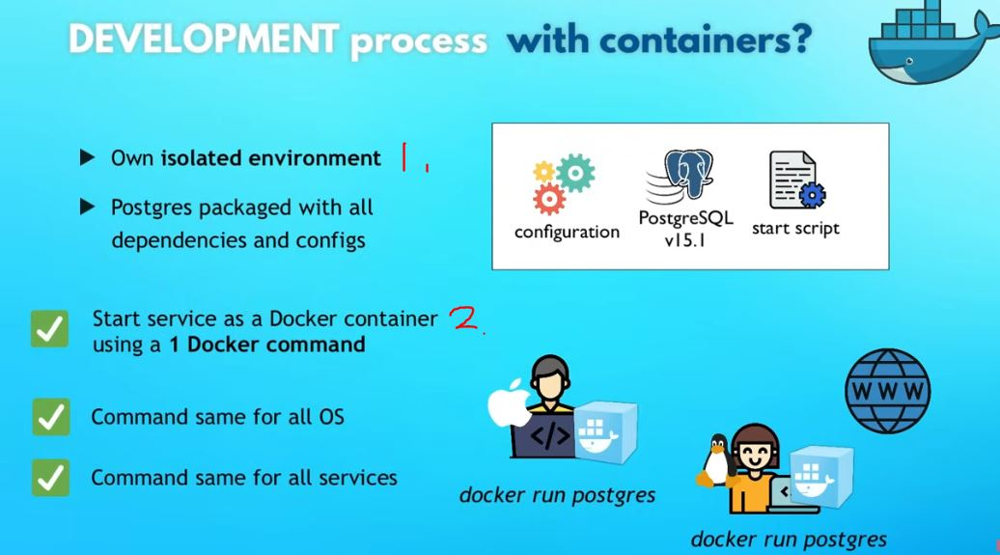
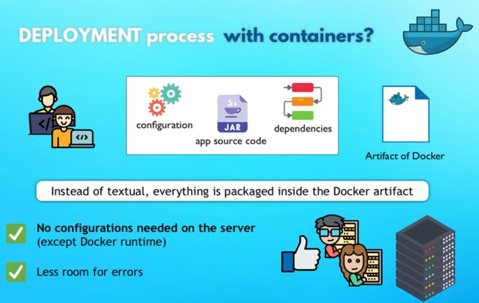
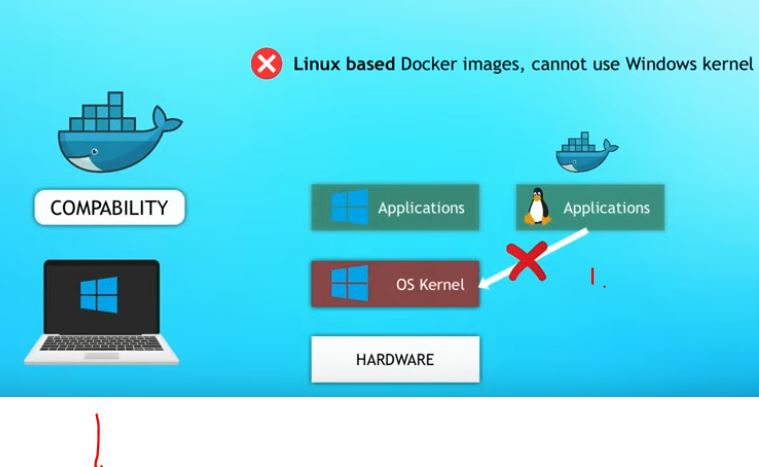
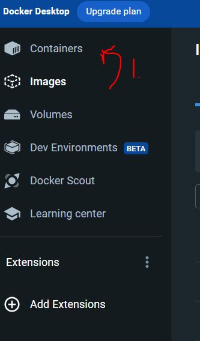
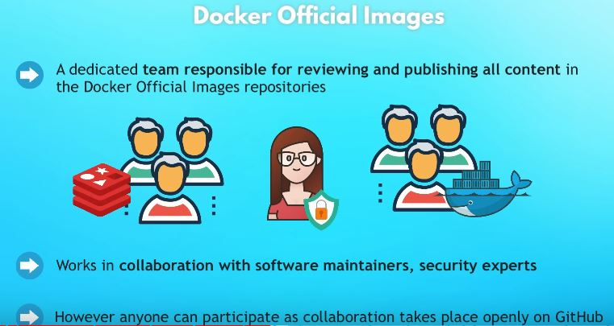
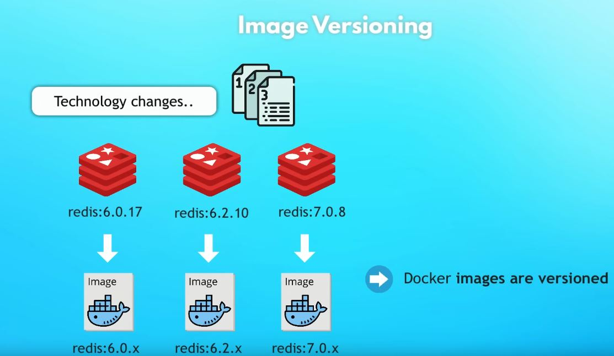

# Docker Crash Course

Tasks and notes from crash course.

[Source](https://www.youtube.com/watch?v=pg19Z8LL06w)

## Video progress

- [x] [Section 01](#) - Intro and Course Overview
- [x] [Section 02](#) - What is Docker?
- [x] [Section 03](#) - What problems Docker solves in development and deployment process
- [x] [Section 04](#) - Virtual Machine vs Docker
- [x] [Section 05](#) - Install Docker
- [x] [Section 06](#)- Docker Images vs Containers
- [x] [Section 07](#) - Docker Registries
- [x] [Section 08](#) - Docker Image Versions
- [x] [Section 09](#) - Main Docker Commands - Pull and Run Docker containers
- [ ] [Section 10](#) - Port Binding
- [ ] [Section 11](#) - Start and Stop containers
- [ ] [Section 12](#) - Private Docker Registries
- [ ] [Section 13](#) - Registry vs Repository
- [ ] [Section 14](#) - Dockerfile - Dockerize Node.js app
- [ ] [Section 15](#) - Build Image
- [ ] [Section 16](#) - Docker UI Client
- [ ] [Section 17](#) - Overview: Docker in complete software development lifecycle
- [ ] [Section 18](#) - Where to go from here

#### What is docker

 - Before containers, all developers needed to install their own setups of tools for their specific needs.
    - Os specific
    - Configuration specific
    - Etc

#### Development/Deployment with Docker 

1. All these decencies are inside container. 
2. As **developer,** you just need to execute **one docker command** and get **docker container package** `docker run postgres`

- Docker standardizes process of running any service on any local dev environment
    - More time for development than setting up configuration
    - With docker you can have same service running on local device whiteout any conflict 

- With containers → DevOps team just needs to fetch and run **Docker artifact**

#### Virtual Machine vs Docker

-  Docker virtualize **OS Application Layer**
- Virtual machine virtualizes
**OS Application Layer** and **OS kernel** → Meaning virtualizes **complete operating system**

- What it means:
    - Docker image is, a couple of **MB**
    - Dockers container takes **seconds** to start
    - Dockers compatible only with **Linux distros**
    - Vm images, a couple of **GB**
    - Vm takes **minutes** to start
    - Vm is running with all **OS**

1. Docker can't run Linux based docker image in **Windows Host**  

- Docker Desktop
    - Linux containers run on Windows or macOS
    - This is solved with **Hypervisor layer** with small Linux distro.
    `install Docker Desktop`

### Docker Images vs Containers

- **Docker images** are like **.jar** a file packaged in containers.
    - It has compiled code
    - It also has **complete environment configuration**
        - Application, any services(Js app)(node, npm) needed, Os Layer(Linux)
    - Add env variables,
    create directories

- **Docker Container** is running image
- You can one you can run multiple container

1. Images can be run in containers

- `docker images` Show what images we have locally

- `docker ps` List running containers

### Docker Registries

- There are images stored in Docker Register

- Official images are available from applications like Redis, Mongo, Postgres etc.
    - There can be verified "Official" images or unofficial ones.

- One the biggest docker register store is DockerHub
    - One of Reddis [Images](https://hub.docker.com/_/redis) 

 ### Docker Image Versions

- If you need specific version, you can choose specific docker image which has right **tag**
    - `latest` is the latest which was build

### Main Docker Commands - Pull and Run Docker containers

- To download image `docker pull nginx:1.23`

- To list images `docker images`

- Running images into container `docker run nginx:1.23`
    - With `-d` stop blocking

- Docker generates random name automatically

### Port Binding