# 1h Crash Course Series Proceeding Order

- [x] [First step 01](#docker-crash-course-in-1h) - Docker Crash Course for Absolute Beginners
- [ ] [Second step 02](#learn-docker-compose) - Learn Docker Compose - From Zero to Hero in 1 Hour 
- [ ] Third step 03 - Kubernetes Crash Course for Absolute Beginners 

# Docker Crash Course In 1h

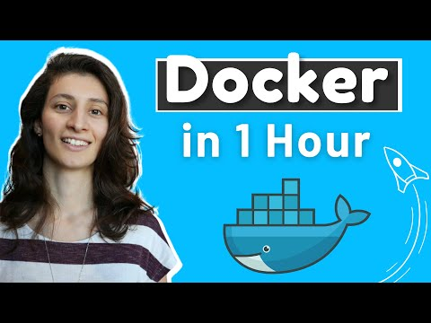

Tasks and notes from crash course. Made by TechWorld with Nana

[Source](https://www.youtube.com/watch?v=pg19Z8LL06w)

- [ ] If time and patience take full course: [Docker Tutorial for Beginners FULL COURSE in 3 Hours](https://www.youtube.com/watch?v=pg19Z8LL06w)

## Video progress

- [x] Section 01 - Intro and Course Overview
- [x] [Section 02](#What-is-docker) - What is Docker?
- [x] Section 03 - What problems Docker solves in development and deployment process
- [x] [Section 04](#Virtual-Machine-vs-Docker) - Virtual Machine vs Docker
- [x] Section 05 - Install Docker
- [x] [Section 06](#Docker-Images-vs-Containers) - Docker Images vs Containers
- [x] [Section 07](#Docker-Registries) - Docker Registries
- [x] [Section 08](#Docker-Image-Versions) - Docker Image Versions
- [x] [Section 09](#Pull-and-Run-Docker-containers) - Main Docker Commands - Pull and Run Docker containers
- [x] [Section 10](#Port-Binding) - Port Binding
- [x] [Section 11](#Start-and-Stop-containers) - Start and Stop containers
- [x] [Section 12](#Private-Docker-Registries) - Private Docker Registries
- [x] [Section 13](#Registry-vs-Repository) - Registry vs Repository
- [x] [Section 14](#Dockerfile) - Dockerfile - Dockerize Node.js app
- [x] [Section 15](#Build-Image) - Build Image
- [x] [Section 16](#Docker-UI-Client) - Docker UI Client
- [x] [Section 17](#Docker-in-complete-software-development-lifecycle) - Overview: Docker in complete software development lifecycle
- [x] Section 18 - Where to go from here

#### What is docker

 - Before containers, all developers needed to install their own setups of tools for their specific needs.
    - Os specific
    - Configuration specific
    - Etc

#### Development/Deployment with Docker 


1. All these decencies are inside container. 
2. As **developer,** you just need to execute **one docker command** and get **docker container package** `docker run postgres`

- Docker standardizes process of running any service on any local dev environment
    - More time for development than setting up configuration
    - With docker you can have same service running on local device whiteout any conflict 


- With containers → DevOps team just needs to fetch and run **Docker artifact**

#### Virtual Machine vs Docker

-  Docker virtualize **OS Application Layer**
- Virtual machine virtualizes
**OS Application Layer** and **OS kernel** → Meaning virtualizes **complete operating system**

- What it means:
    - Docker image is, a couple of **MB**
    - Dockers container takes **seconds** to start
    - Dockers compatible only with **Linux distros**
    - Vm images, a couple of **GB**
    - Vm takes **minutes** to start
    - Vm is running with all **OS**


1. Docker can't run Linux based docker image in **Windows Host**  

- Docker Desktop
    - Linux containers run on Windows or macOS
    - This is solved with **Hypervisor layer** with small Linux distro.
    `install Docker Desktop`

### Docker Images vs Containers

- **Docker images** are like **.jar** a file packaged in containers.
    - It has compiled code
    - It also has **complete environment configuration**
        - Application, any services(Js app)(node, npm) needed, Os Layer(Linux)
    - Add env variables,
    create directories

- **Docker Container** is running image
- You can one you can run multiple container


1. Images can be run in containers

- `docker images` Show what images we have locally

- `docker ps` List running containers

### Docker Registries

- There are images stored in Docker Register

- Official images are available from applications like Redis, Mongo, Postgres etc.
    - There can be verified "Official" images or unofficial ones.

- One the biggest docker register store is DockerHub
    - One of Reddis [Images](https://hub.docker.com/_/redis) 


 ### Docker Image Versions


- If you need specific version, you can choose specific docker image which has right **tag**
    - `latest` is the latest which was build

### Pull and Run Docker containers

- To download image `docker pull nginx:1.23`


- To list images `docker images`

- Running images into container `docker run nginx:1.23`
    - With `-d` stop blocking

- Docker generates random name automatically


### Port Binding

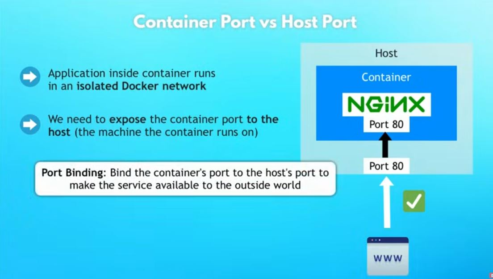

- We need to **expose** container **ports**
    - This is done with **Port Binding** 

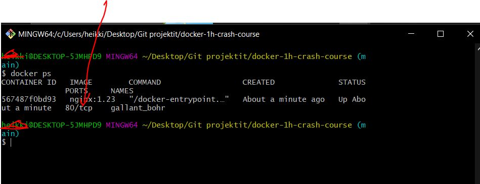

- You can see what ports containers are running in

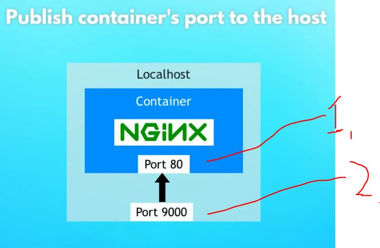

1. Port inside container
2. Exposing port to local host

- We can expose ports to localhost when creating container with special **flag**


<br>


- We can publish ports when creating image with **flag** 

`docker run -d -p 9000:80 nginx:1.23`


- With following port structure


<br>

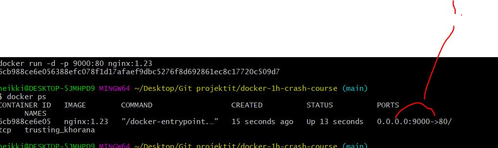

1. After running with opening with following ports
    - We can see what is being mapped on 

<br>

- Now we can see its deployed into port 9000

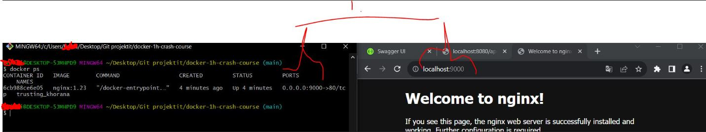

- To expose logs from docker 
    - `docker logs 6cb988ce6e05`, where last one is docker id

- It's standard to bind same port into container and which is exposed outside of container

### Start and Stop containers

- Docker run always creates new container

- To see all container which docker have created. You can use 

`docker ps -a`
- To start container you can use `docker start {container} = start one or more stopped containers`. Example `docker logs 6cb988ce6e05`

### Private Docker Registries

- When companies, creates their own public private docker registries.

### Registry vs Repository

<br>

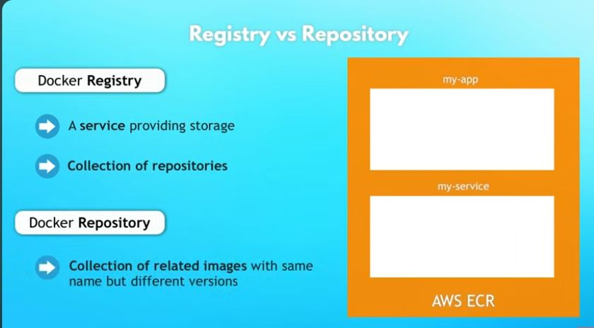

### Dockerfile

- We want to build our docker image, when our application version is finished
    - We do this by writing "definition" how to build image
        - This is called **docker file**

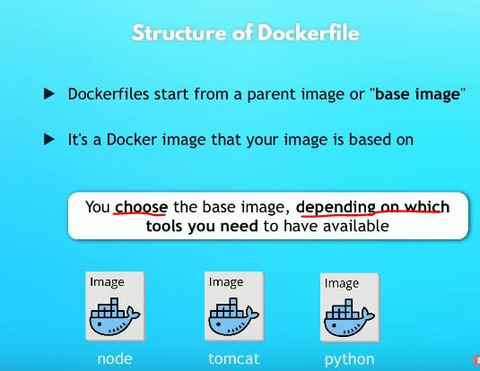

- Telling to build base image **FROM** base image

<br>

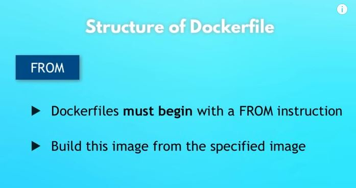

- In docker file you can run Linux commands!
    - This is done with **RUN** directive

- **COPY** copies files from src and adds them to containers path

- **WORKDIR /app** changes working directly inside docker

- Last command in docker file is **CMD**

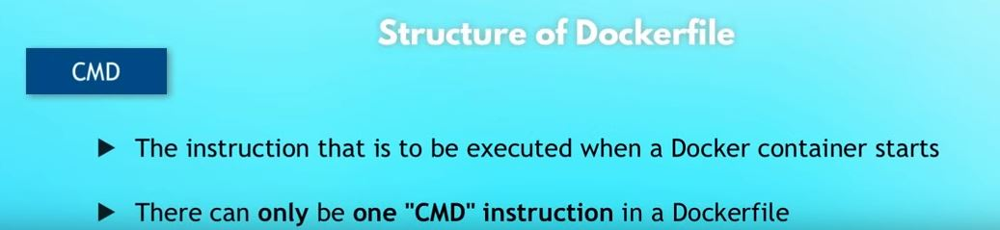

#### Example of docker file

```

FROM node:19-alpine

COPY package.json /app/
COPY src /app/

# COPY src /app/, last / is important. Docker will create new folder if there is no 

WORKDIR /app

RUN npm install

CMD ["node", "server.js"]

```

### Build Image


<br>


- Building image `docker build -t node-app:1.0 .`
    - Last one is location of Dockerfile

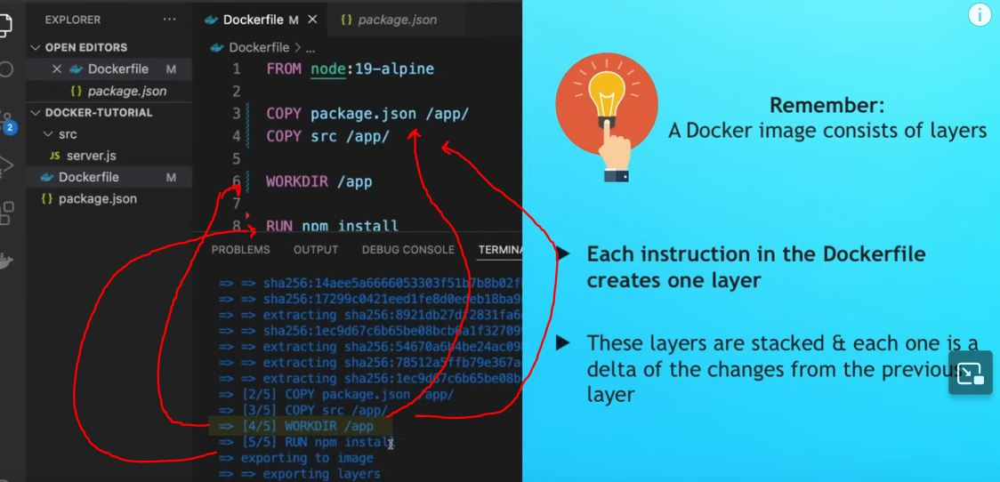

- You can see image is created in layers

- We can run our newly created image `docker run -d -p 3000:3000 node-app:1.0`

- We can see that our application inside docker is running and its being exposed to `localhost:3000`

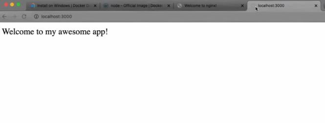

### Docker UI Client

- Same tool is found in UI

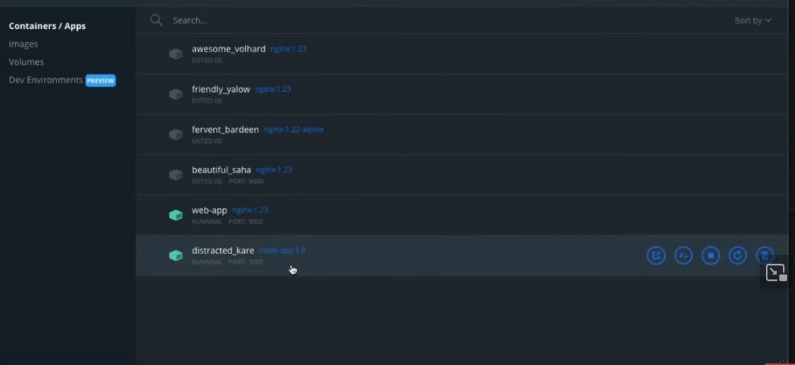

### Docker in complete software development lifecycle

- CI server can create docker image automatically 

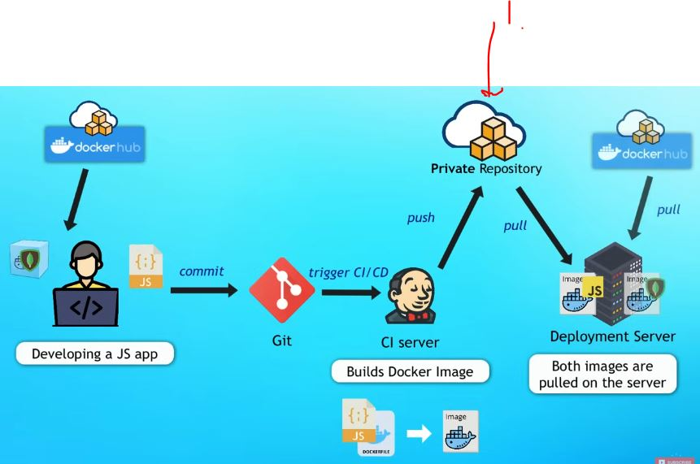

1. After commit, **CI server** can be configured with to push and create docker image into **Private Repository**

### Additional about docker

- We can connect docker app and MySQL with help of **network**

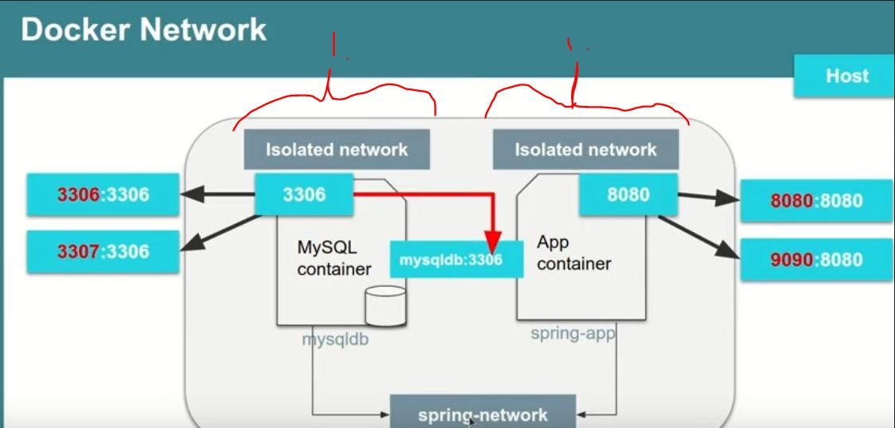

1. When running docker container they are running in isolated networks

- Listing all network `docker network ls`

- Creating docker network `docker network create spring-net`

- Connecting our **container** with given **network** `docker network connect spring-net mysqldb`

- Inspecting our container for attached networks `docker container inspect mysqldb`

- We can attach container to **certain network** when starting the container

```
docker run -p 9090:8080 --name app --net spring-net -e MYSQL_HOST=mysqldb -e MYSQL_USER=root -e MYSQL_PASSWORD=root -e MYSQL_PORT=3306 app
```

## Creating MySQL running in localhost container

- Starting and pulling and starting MySQL image `docker run -d -p 3307:3306 --name mysqldb -e MYSQL_ROOT_PASSWORD=root -e MYSQL_DATABASE=user_rest_demo mysql`

- To test connection `localhost:3007` and configure `allowPublicKeyRetrieval` to **true**

## Docker Volume

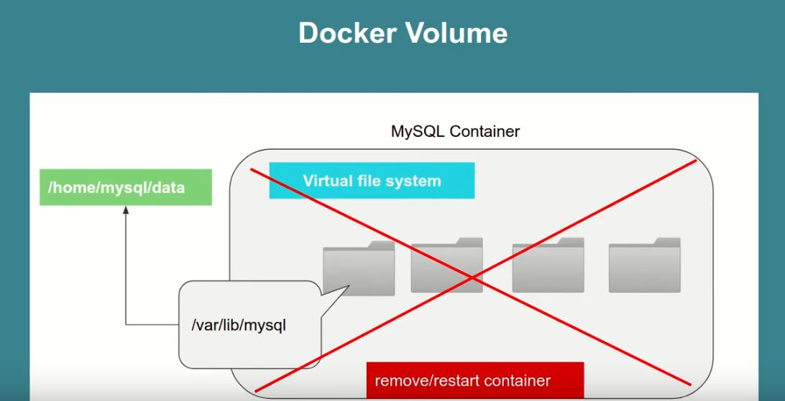

- When restarting application data is lost, we can use **volumes** to keep data saved


# Learn Docker Compose

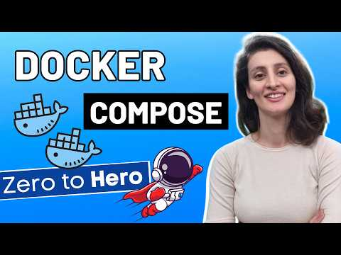

Tasks and notes from crash course. Made by TechWorld with Nana

[Source](https://www.youtube.com/watch?v=SXwC9fSwct8)

## Video progress

- [x] [Section 01](#intro-and-course-overview) - Intro and Course Overview
- [x] [Section 02](#pre-requisites-to-learn-docker-compose) - Pre-Requisites to learn Docker Compose
- [ ] [Section 03](#what-is-docker-compose) - What is Docker Compose
- [ ] [Section 04](#demo-without-docker-compose) - Demo - Without Docker Compose
- [ ] [Section 05](#why-docker-compose) - Why Docker Compose
- [ ] [Section 06](#from-docker-commands-to-compose-file) - From Docker Commands To Compose File
- [ ] [Section 07](#create-compose-file-and-start-application) - Create Compose File and start application
- [ ] [Section 08](#control-startup-order) - Control Startup Order
- [ ] [Section 09](#docker-compose-commands) - Docker Compose Commands (Up and Down vs Start and Stop) 
- [ ] [Section 10](#connect-own-web-application) - Connect own web application
- [ ] [Section 11](#variables-in-docker-compose) - Variables in Docker Compose
- [ ] [Section 12](#docker-compose-secrets) - Docker Compose Secrets
- [ ] [Section 13](#use-image-from-private-repository) - Use image from private repository
- [ ] [Section 14](#limitations,-docker-compose-vs-kubernetes) - Limitations, Docker Compose vs Kubernetes

# Intro and Course Overview

 - We will cover:
    - **What** is Docker compose
    - **What problems** it solves?
    - Common **Use cases**
    - Hands-on **demos**
    - **Limitations** of Docker compose

# Pre-Requisites to learn Docker Compose

- It's necessarily to know Docker containers before this one, if no [Watch](Docker-Crash-Course-In-1h)

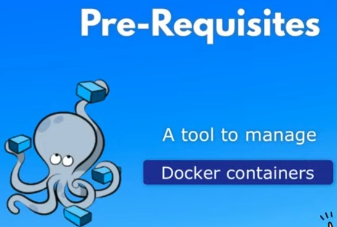

# What is Docker Compose

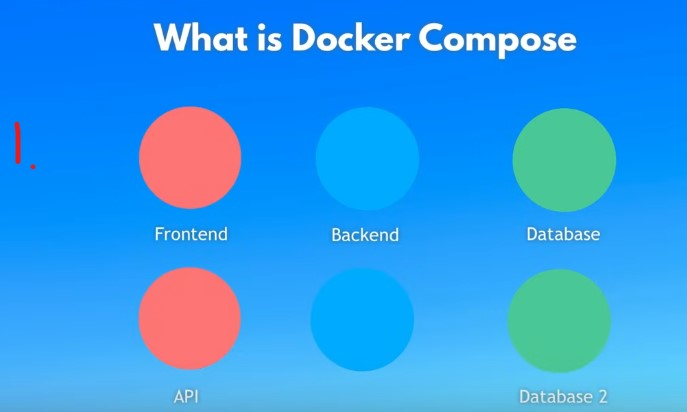

1. Application can be broken into smaller pieces
    - Or **Microservice** application

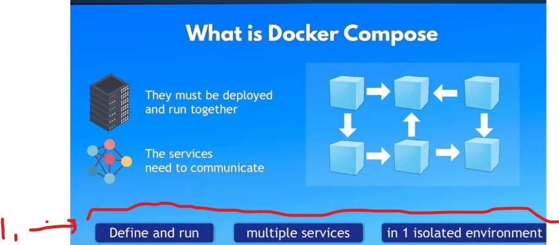

- All of these software components must be containerized and deployed/run together.
    - These services need to communicate together 

1. We need some tool to control these actions:
    - Define and run multiple Services in 1 environment
- Each container is having own configuration and for this we can use **Docker Compose**, which makes our life more easier.  

# Demo - Without Docker Compose

- Demo will have 2 Docker containers    
    - Just with **Docker** commands

1. Create Docker Network
2. Start MongoDB Container
3. Start Mongo Express Container(UI for MongoDB)


```
-todo komennot tähän
```

# Why Docker Compose

- todo

# From Docker Commands To Compose File

- todo

# Create Compose File and start application

- todo


# Control Startup Order

- todo

# Docker Compose Commands 

- todo

#  Connect own web application

- todo 

# Variables in Docker Compose

- todo

# Docker Compose Secrets

- todo

# Use image from private repository

- todo 

# Limitations, Docker Compose vs Kubernetes

- todo