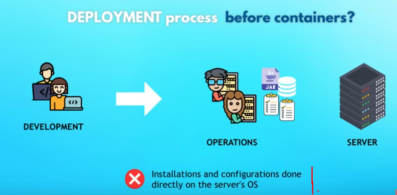
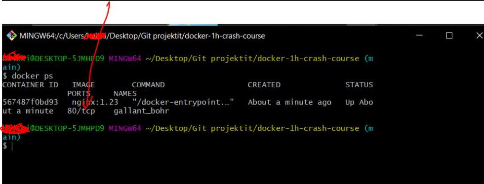
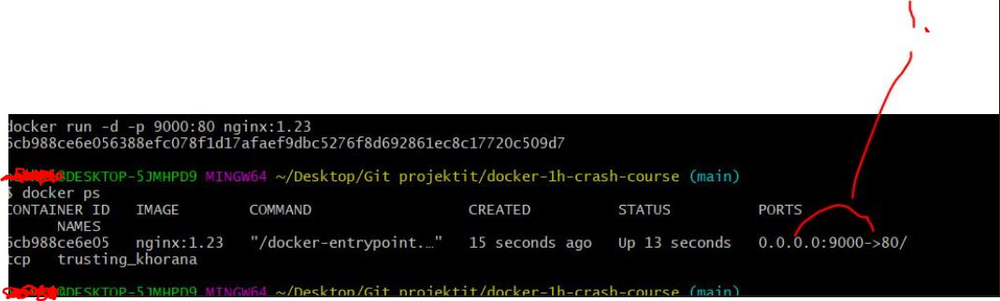
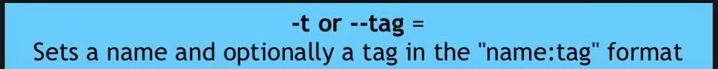
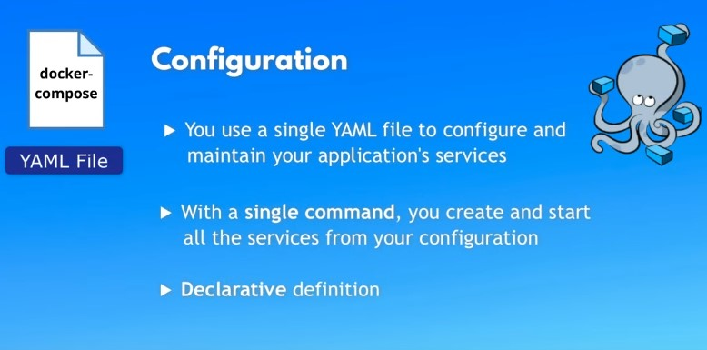
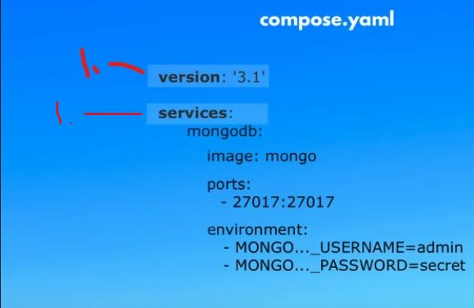

# 1h Crash Course Series Proceeding Order.

- [x] [First step 01](#docker-crash-course-in-1h) - Docker Crash Course for Absolute Beginners.
- [ ] [Second step 02](#learn-docker-compose-in-1h) - Learn Docker Compose - From Zero to Hero in 1 Hour. 
    - [x] [Good to Know - Prerequisite step](https://github.com/developersCradle/1h-course-series-with-nana/tree/main/yaml#yaml_cerificate) - Yaml Tutorial | Learn YAML in 18 mins. 
    - [ ] [Good to Know - Prerequisite step](#) - Microservices explained - the What, Why and How?
- [ ] [Third step 03](#kubernetes-crash-course-for-absolute-beginners-in-1h) - Kubernetes Crash Course for Absolute Beginners. 

### Additional stuff.

- [ ] Make combined certificate for all these software development tools. 

- [ ] If time and patience take full course: [Docker Tutorial for Beginners FULL COURSE in 3 Hours](https://www.youtube.com/watch?v=3c-iBn73dDE&t=0s).

# Docker Crash Course In 1h.


Tasks and notes from crash course. Made by **TechWorld with Nana**. Contains my own notes for not just watch videos.

[Source](https://www.youtube.com/watch?v=pg19Z8LL06w).

[Source Repository](https://gitlab.com/nanuchi/docker-in-1-hour).

If the content sparked 🔥 your interest, please consider staring the course and start learning 📖.

<!-- 
Linkedin puts this shit front, when clicking from private mode x(. Need to put this to make jump working every case
?trk=public_profile_see-credential 
-->


**Note: The material provided in this repository is only for helping those who may get stuck at any point of time in the course. It is very advised that no one should just copy the solutions(violation of Honor Code) presented here.**


## Progress/Curriculum

- [x] [Section 01](#Intro-and-Course-Overview) - Intro and Course Overview. ✅
- [x] [Section 02](#What-is-docker) - What is Docker? ✅
- [x] [Section 03](#) - What problems Docker solves in development and deployment process. ✅
- [x] [Section 04](#Virtual-Machine-vs-Docker) - Virtual Machine vs Docker. ✅
- [x] [Section 05](#) - Install Docker. ✅
- [x] [Section 06](#Docker-Images-vs-Containers) - Docker Images vs Containers.
- [x] [Section 07](#Docker-Registries) - Docker Registries.
- [x] [Section 08](#Docker-Image-Versions) - Docker Image Versions.
- [x] [Section 09](#Pull-and-Run-Docker-containers) - Main Docker Commands - Pull and Run Docker containers.
- [x] [Section 10](#Port-Binding) - Port Binding.
- [x] [Section 11](#Start-and-Stop-containers) - Start and Stop containers.
- [x] [Section 12](#Private-Docker-Registries) - Private Docker Registries.
- [x] [Section 13](#Registry-vs-Repository) - Registry vs Repository.
- [x] [Section 14](#Dockerfile) - Dockerfile - Dockerize Node.js app.
- [x] [Section 15](#Build-Image) - Build Image.
- [x] [Section 16](#Docker-UI-Client) - Docker UI Client.
- [x] [Section 17](#Docker-in-complete-software-development-lifecycle) - Overview: Docker in complete software development lifecycle
- [x] Section 18 - Where to go from here.

# Intro and Course Overview.

- We wil be covering following:


# What is docker.


- **Container** is packed all the different parts inside. 

# What problems Docker solves in development and deployment process.

- Before **Docker**, all developers needed to install their own setups of tools for their specific needs.
    - Os specific.
    - Configuration specific.
    - Etc.


1. Setting up environment individually different to different os.


1. All these dependencies are inside container. 
2. As **developer,** you just need to execute **one docker command** and get **docker container package** `docker run postgres`.

- Docker **standardizes** process of running any service on any local dev environment.
    - **More** time for development than setting up configuration.
    - With docker you can have same service running on local device whiteout any conflict. 


- With containers → DevOps team just needs to fetch and run **Docker artifact**.


1. Different versions of same application. **This is very** difficult without **docker**.



1. Old way was, develop and ship it to the devOps team, which made configuration and installation. This was very error prone.


- There will be **Docker Artifact** which handles.


# Virtual Machine vs Docker.

- Big questions below.


1. OS will be installing on the system and it will communicate between **different** layers.

2. **Software** will be on top of application layer. This will be communicating with the **OS layer**. 


- So the **big question** these both **docker** and **vm** are virtualization tools, so which layer these both **virtualize**.


- Docker virtualize **OS Application Layer**.
- Virtual machine virtualizes.
**OS Application Layer** and **OS kernel** → Meaning virtualizes **complete operating system**.


- What it means:
    - Docker image is, a couple of **MB**.
    - Dockers container takes **seconds** to start.
    - Dockers compatible only with **Linux distros**.
    - Vm images, a couple of **GB**.
    - Vm takes **minutes** to start.
    - Vm is running with all **OS**.


1. Docker can't run Linux based docker image in **Windows Host**.

- Docker Desktop.
    - Linux containers run on Windows or macOS.
    - This is solved with **Hypervisor layer** with small Linux distro.
    `install Docker Desktop`.

#  Install Docker.

- Installing latest from docker website.


# Docker Images vs Containers.

- This image is like **.zip** and **.jar** file.


- **Docker images** are like **.jar** a file packaged in containers.
    - It has compiled code.
    - It also has **complete environment configuration**.
        - Application, any services(Js app)(node, npm) needed, Os Layer(Linux).
    - Add env variables, create directories.

- **Docker Container** is running image.
- You can one you can run multiple container.


1. Images can be run in containers

- `docker images` Show what images we have locally

- `docker ps` List running containers

# Docker Registries.

- There are images stored in Docker Register

- Official images are available from applications like Redis, Mongo, Postgres etc.
    - There can be verified "Official" images or unofficial ones.

- One the biggest docker register store is **DockerHub**
    - One of Reddis [Images](https://hub.docker.com/_/redis) 


 # Docker Image Versions.


- If you need specific version, you can choose specific docker image which has right **tag**
    - `latest` is the latest which was build

# Pull and Run Docker containers.

- To download image `docker pull nginx:1.23`


- To list images `docker images`

- Running images into container `docker run nginx:1.23`
    - With `-d` stop blocking

- Docker generates random name automatically


# Port Binding.


- We need to **expose** container **ports**
    - This is done with **Port Binding** 



- You can see what ports containers are running in


1. Port inside container
2. Exposing port to local host

- We can expose ports to localhost when creating container with special **flag**


<br>


- We can publish ports when creating image with **flag** 

`docker run -d -p 9000:80 nginx:1.23`


- With following port structure


<br>



1. After running with opening with following ports
    - We can see what is being mapped on 

<br>

- Now we can see its deployed into port 9000


- To expose logs from docker 
    - `docker logs 6cb988ce6e05`, where last one is docker id

- It's standard to bind same port into container and which is exposed outside of container

# Start and Stop containers.

- Docker run always creates new container

- To see all container which docker have created. You can use 

`docker ps -a`
- To start container you can use `docker start {container} = start one or more stopped containers`. Example `docker logs 6cb988ce6e05`

# Private Docker Registries.

- When companies, creates their own public private docker registries.

# Registry vs Repository.

<br>


# Dockerfile.

- We want to build our docker image, when our application version is finished
    - We do this by writing "definition" how to build image
        - This is called **docker file**


- Telling to build base image **FROM** base image

<br>


- In docker file you can run Linux commands!
    - This is done with **RUN** directive

- **COPY** copies files from src and adds them to containers path

- **WORKDIR /app** changes working directly inside docker

- Last command in docker file is **CMD**


# Example of docker file.

```

FROM node:19-alpine

COPY package.json /app/
COPY src /app/

# COPY src /app/, last / is important. Docker will create new folder if there is no 

WORKDIR /app

RUN npm install

CMD ["node", "server.js"]

```

# Build Image.


<br>




- Building image `docker build -t node-app:1.0 .`
    - Last one is location of Dockerfile


- You can see image is created in layers

- We can run our newly created image `docker run -d -p 3000:3000 node-app:1.0`

- We can see that our application inside docker is running and its being exposed to `localhost:3000`


# Docker UI Client.

- Same tool is found in UI.


# Docker in complete software development lifecycle.

- CI server can create docker image automatically 


1. After commit, **CI server** can be configured with to push and create docker image into **Private Repository**

# Additional about docker.

- We can connect docker app and MySQL with help of **network**


1. When running docker container they are running in isolated networks

- Listing all network `docker network ls`.

- Creating docker network `docker network create spring-net`.

- Connecting our **container** with given **network** `docker network connect spring-net mysqldb`.

- Inspecting our container for attached networks `docker container inspect mysqldb`.

- We can attach container to **certain network** when starting the container.

```
docker run -p 9090:8080 --name app --net spring-net -e MYSQL_HOST=mysqldb -e MYSQL_USER=root -e MYSQL_PASSWORD=root -e MYSQL_PORT=3306 app
```

# Creating MySQL running in localhost container.

- Starting and pulling and starting MySQL image `docker run -d -p 3307:3306 --name mysqldb -e MYSQL_ROOT_PASSWORD=root -e MYSQL_DATABASE=user_rest_demo mysql`.

- To test connection `localhost:3007` and configure `allowPublicKeyRetrieval` to **true**.

# Docker Volume.


- When restarting application data is lost, we can use **volumes** to keep data saved.

# Learn Docker Compose In 1h.


Tasks and notes from crash course. Made by TechWorld with **Nana**.

[Source](https://www.youtube.com/watch?v=SXwC9fSwct8)

[Source Repository](https://gitlab.com/twn-youtube/docker-compose-crash-course)

If the content sparked 🔥 your interest, please consider staring the course and start learning 📖

<!-- 
Linkedin puts this shit front, when clicking from private mode x(. Need to put this to make jump working every case
?trk=public_profile_see-credential 
-->


**Note: The material provided in this repository is only for helping those who may get stuck at any point of time in the course. It is very advised that no one should just copy the solutions(violation of Honor Code) presented here.**

# Progress/Curriculum

- [x] [Section 01](#intro-and-course-overview) - Intro and Course Overview
- [x] [Section 02](#pre-requisites-to-learn-docker-compose) - Pre-Requisites to learn Docker Compose
- [x] [Section 03](#what-is-docker-compose) - What is Docker Compose
- [x] [Section 04](#demo-without-docker-compose) - Demo - Without Docker Compose
- [x] [Section 05](#why-docker-compose) - Why Docker Compose
- [x] [Section 06](#from-docker-commands-to-compose-file) - From Docker Commands To Compose File
- [x] [Section 07](#create-compose-file-and-start-application) - Create Compose File and start application
- [x] [Section 08](#control-startup-order) - Control Startup Order
- [x] [Section 09](#docker-compose-commands) - Docker Compose Commands (Up and Down vs Start and Stop) 
- [x] [Section 10](#connect-own-web-application) - Connect own web application
- [ ] [Section 11](#variables-in-docker-compose) - Variables in Docker Compose
- [ ] [Section 12](#docker-compose-secrets) - Docker Compose Secrets
- [ ] [Section 13](#use-image-from-private-repository) - Use image from private repository
- [ ] [Section 14](#limitations,-docker-compose-vs-kubernetes) - Limitations, Docker Compose vs Kubernetes

<hr>

# Intro and Course Overview.

 - We will cover:
    - **What** is Docker compose
    - **What problems** it solves?
    - Common **Use cases**
    - Hands-on **demos**
    - **Limitations** of Docker compose

# Pre-Requisites to learn Docker Compose.

- It's necessarily to know Docker containers before this one, if no [Watch](#docker-crash-course-in-1h)
    - It's advised to learn **YAML** format, if no [Check](#)


# What is Docker Compose.


1. Application can be broken into smaller pieces.
    - Or **Microservice** application.


- All of these software components must be containerized and deployed/run together.
    - These services need to communicate together.

1. We need some tool to control these actions:
    - Define and run multiple Services in 1 environment.
- Each container is having own configuration and for this we can use **Docker Compose**, which makes our life easier.  

# Demo - Without Docker Compose.

- Demo will have 2 Docker containers.    
    - Just with **Docker** commands.

1. Create Docker Network.
2. Start MongoDB Container.
3. Start Mongo Express Container(UI for MongoDB).

```
//Create mongo-network first
docker network create
 mongo-network
```


1. We can see network is being created.

```

//List all networks
docker network ls

```

- Running MongoDB in Docker.
    - You can see default ports from [Docker Hub](https://hub.docker.com/_/mongo) and default usernames and passwords.

- For **mongoDB**.

```
docker run -d -p 27017:27017 -e MONGO_INITDB_ROOT_USERNAME=admin -e MONGO_INITDB_ROOT_PASSWORD=supersecret --network mongo-network --name mongodb mongo
```

- For **mongo-express**.
    - Its just font-end for **mongoDB**.

```
docker run -d -p 8081:8081 -e ME_CONFIG_MONGODB_ADMINUSERNAME=admin -e ME_CONFIG_MONGODB_ADMINPASSWORD=supersecret -e ME_CONFIG_MONGODB_SERVER=mongodb --network mongo-network --name mongo-express mongo-express
```

- To try if these work go to `http://localhost:8081/` and log in
    - **mongoDB** depends on **mongo-express** and to communicate each other **isolated virtual network** must be configured and working!

# Why Docker Compose.


1. Problem comes when a lot of containers are needed to start and configure to communicate 

- We have one way to manage these → **Docker Compose**.  
    - This is based on **YAML File**



# From Docker Commands To Compose File.

- **Docker-Compose** abstract all the **CMD** commands into **docker-compose** file.


<br>



1. **Required** attributes for docker file!
    - First line, **version** of docker-compose which **needs** to be compatible with Compose is **installed locally**
2. **Services**. List all services, you want to run


1. YAML transfers this cmd commands to **.YAML** one configurable file 
    - Here you can see one service **being configured**.
2. Name of service being configured.


1. **Container name**, this will map form command to

2. From which **image name** docker container will be built from. You can specify version list

3. **List of ports** which will be mapping to container.
    - Most time this
    you have only one **mapping**
        - `3.1` **Host** port and `3.2` port inside **Container** 
4. List of Environment variables for docker 


- As you can see another service is below other one!

<br>


- This how the **YAML** will look like for previous example configuration.

- ***Docker Compose** can help your team to collaborate more efficiently since, now they can see how these services can be run separately. **Not** just random cmd commands.


1. You don't have to include network to **YAML** configuration. This will be taken care by default in docker compose 
    - Docker takes care of creating **docker network**
        - From services from list


1. When making **YAML** file be careful of indentation

- Running **YAML**

# Docker Compose Commands 

- We are trying to execute **compose** file
    - First we remove our old **networks** and **containers**


```
docker rm hashGoesHere // Removing container

docker network rm mongo-network // Removing docker network
```

- If you have **docker** installed in your computer, you don't need to install **Docker Compose**

- starting with docker compose
    - `docker-build -f mongo-services.yaml up`
        - `up` argument for running from up to down different services


<br>


1. You can see how **network names** are created. **1.** prefix from folder where **.YAML** was run. 

> Docker basically takes folder where it was executed and prefixes with names.

- Docker logs are mixed since two containers were started at sane time.

# Control Startup Order

- When multiple services
    - When we need db before front-end

- This decency can be done using `depends_on`
    - This affects control of the services
    - This will start container **only** when dependencies are finished


- Example using `depends_on:` in case of **mongo-express:**


```
  mongo-express:
    image: mongo-express
    ports:
     - 8081:8081
    environment:
      ME_CONFIG_MONGODB_ADMINUSERNAME=: admin
      ME_CONFIG_MONGODB_ADMINPASSWORD=: supersecret
      ME_CONFIG_MONGODB_SERVER=: mongodb
    depends_on:
      - "mongodb" # Takes list of services
```

- Whole `mongo-express` service **won't be** started, before `mongodb` is up and running


- Running following **Compose** in detach mode `docker-compose -f mongo-services.yaml up -d`


# Docker Compose Commands (Up and Down vs Start and Stop)

- We could stop containers using `docker stop`, but with big compose files this get problematic


1. We can close all containers in the same time and remove them with following command `docker-compose -f mongo-services.yaml down`
    - This will clean **networks**, **containers** and **docker images**


1. Data will be gone once container is removed
2. Unless you define **volumes**


1.  Data will be lost when container is removed
2.  Data will be saved

- These have different **use cases** 

# Connect own web application

- Here we will add own app to our services

# Variables in Docker Compose

- todo

# Docker Compose Secrets

- todo

# Use image from private repository

- todo 


# Limitations, Docker Compose vs Kubernetes

- todo

## Kubernetes Crash Course for Absolute Beginners In 1h


Tasks and notes from crash course. Made by TechWorld with Nana

[Source](https://www.youtube.com/watch?v=X48VuDVv0do&t=0s)

If the content sparked 🔥 your interest, please consider staring the course and start learning 📖

- [ ] If time and patience take full course: [Kubernetes Tutorial for Beginners FULL COURSE in 4 Hours](https://www.youtube.com/watch?v=pg19Z8LL06w)

## Progress/Curriculum

- [ ] [Section 01](#) - Intro and Course Overview.
- [ ] [Section 02](#) - What is Kubernetes.
- [ ] [Section 03](#) - Kubernetes Architecture.
- [ ] [Section 04](#) -
- [ ] [Section 05](#) -
- [ ] [Section 06](#) -
- [ ] [Section 07](#) -
- [ ] [Section 08](#) -
- [ ] [Section 09](#) -
- [ ] [Section 10](#) -
- [ ] [Section 11](#) -
- [ ] [Section 12](#) -
- [ ] [Section 13](#) -


# Intro and Course Overview.

1. Introduction.
2. Main components
3. Setup.
4. Demo project.

# What is Kubernetes.


1. There can be hundreds or thousands of containers.

- What problems does **Kubernetes** solve?
- What are the tasks of the **orchestration** tool?


- What features orchestration tool offer?


1. User can access is it fast!
2. More load when more load.
3. Backing up data, if something goes wrong.

# Kubernetes Architecture.


1. At least one **master** node.
2. **Worker Node** referred as `Nodes`
    - These having `kubelet` process running on it.
        - This is part of **Kubernetes**, so these nodes can communicate with each other. 
3. Each work node has docker containers deployed on it!
4. So **what** is running on master node? There is multiple **kubernetes** processes running here to manage the **cluster**.


1. API Server, gateway to the **K8** cluster. 
    **1.2** This gateway can be accessed thought **UI**, **API** or **CLI**. 


# Node and Pod.
- Todo
# Main K8s Components.
- Todo
# Node & Pod.
- Todo
# Service & Ingress.
- Todo
# ConfigMap & Secret.
- Todo
# Volume.
- Todo
# Deployment & StatefulSet.
- Todo
# Kubernetes Configuration.
- Todo
# Minikube and Kubectl - Setup K8s cluster locally.
- Todo
# Complete Demo Project: Deploy WebApp with MongoDB.
- Todo
# Interacting with Kubernetes Cluster.
- Todo.
# Congrats! You made it to the end.
- Todo