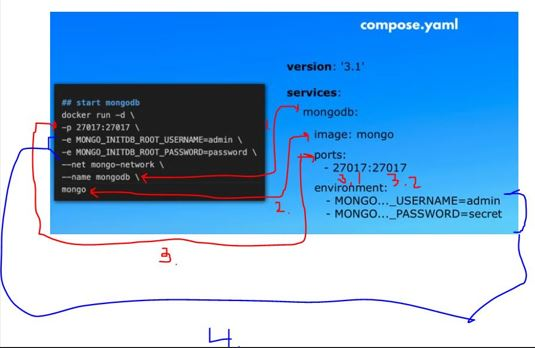
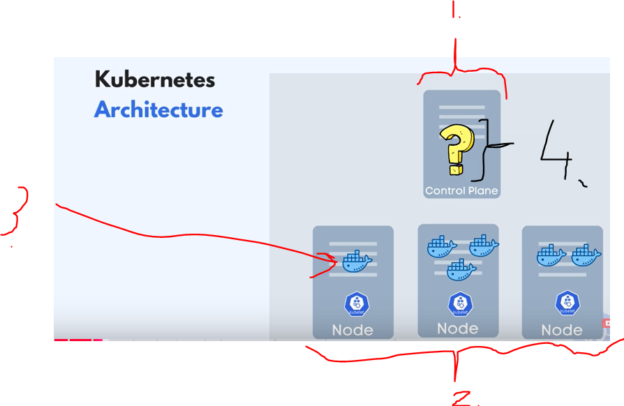
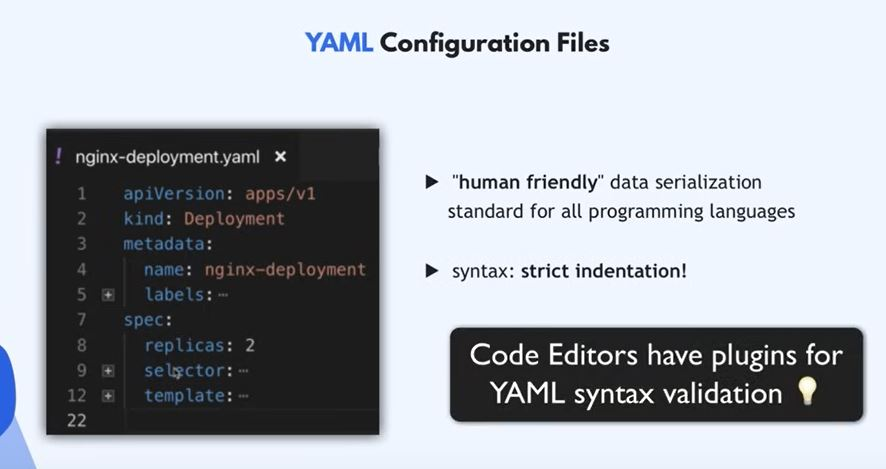
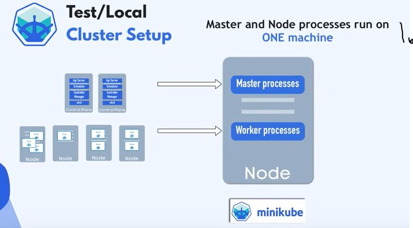
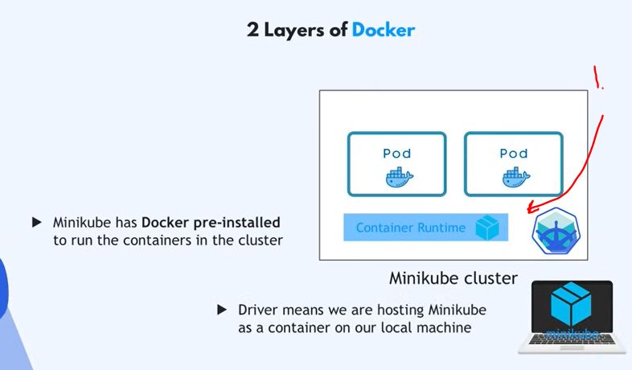
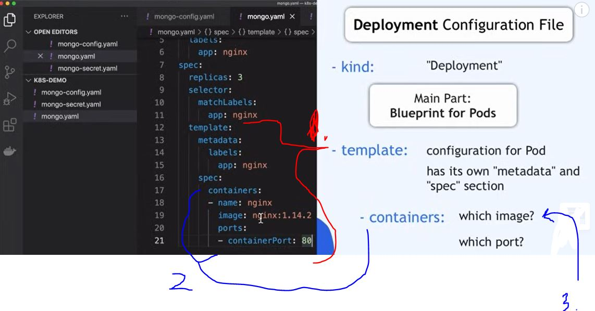

# 1h Crash Course Series Proceeding Order.

- [x] [First step 01](#docker-crash-course-in-1h) - Docker Crash Course for Absolute Beginners. ✅
- [ ] [Second step 02](#learn-docker-compose-in-1h) - Learn Docker Compose - From Zero to Hero in 1 Hour. 
    - [x] [Good to Know - Prerequisite step](https://github.com/developersCradle/1h-course-series-with-nana/tree/main/yaml#yaml_cerificate) - Yaml Tutorial | Learn YAML in 18 mins. ✅
    - [ ] [Good to Know - Prerequisite step](#) - Microservices explained - the What, Why and How?
- [ ] [Third step 03](#kubernetes-crash-course-for-absolute-beginners-in-1h) - Kubernetes Crash Course for Absolute Beginners. 

# Docker Crash Course In 1h.


Tasks and notes from crash course. Made by **TechWorld with Nana**. Contains my own notes for not just watch videos.

[Source](https://www.youtube.com/watch?v=pg19Z8LL06w).

[Source Repository](https://gitlab.com/nanuchi/docker-in-1-hour).

If the content sparked 🔥 your interest, please consider staring the course and start learning 📖.

<!-- 
Linkedin puts this shit front, when clicking from private mode x(. Need to put this to make jump working every case
?trk=public_profile_see-credential 
-->


**Note: The material provided in this repository is only for helping those who may get stuck at any point of time in the course. It is very advised that no one should just copy the solutions(violation of Honor Code) presented here.**


### Additional stuff.

- [ ] Make combined certificate for all these software development tools. 

- [ ] If time and patience take full course: [Docker Tutorial for Beginners FULL COURSE in 3 Hours](https://www.youtube.com/watch?v=3c-iBn73dDE&t=0s).

## Progress/Curriculum

- [x] [Section 01](#Intro-and-Course-Overview) - Intro and Course Overview. ✅
- [x] [Section 02](#What-is-docker) - What is Docker? ✅
- [x] [Section 03](#) - What problems Docker solves in development and deployment process. ✅
- [x] [Section 04](#Virtual-Machine-vs-Docker) - Virtual Machine vs Docker. ✅
- [x] [Section 05](#) - Install Docker. ✅
- [x] [Section 06](#Docker-Images-vs-Containers) - Docker Images vs Containers.
- [x] [Section 07](#Docker-Registries) - Docker Registries.
- [x] [Section 08](#Docker-Image-Versions) - Docker Image Versions.
- [x] [Section 09](#Pull-and-Run-Docker-containers) - Main Docker Commands - Pull and Run Docker containers.
- [x] [Section 10](#Port-Binding) - Port Binding.
- [x] [Section 11](#Start-and-Stop-containers) - Start and Stop containers.
- [x] [Section 12](#Private-Docker-Registries) - Private Docker Registries.
- [x] [Section 13](#Registry-vs-Repository) - Registry vs Repository.
- [x] [Section 14](#Dockerfile) - Dockerfile - Dockerize Node.js app.
- [x] [Section 15](#Build-Image) - Build Image.
- [x] [Section 16](#Docker-UI-Client) - Docker UI Client.
- [x] [Section 17](#Docker-in-complete-software-development-lifecycle) - Overview: Docker in complete software development lifecycle
- [x] Section 18 - Where to go from here.

# Intro and Course Overview.

- We wil be covering following:


# What is docker.


- **Container** is packed all the different parts inside. 

# What problems Docker solves in development and deployment process.

- Before **Docker**, all developers needed to install their own setups of tools for their specific needs.
    - Os specific.
    - Configuration specific.
    - Etc.


1. Setting up environment individually different to different os.


1. All these dependencies are inside container. 
2. As **developer,** you just need to execute **one docker command** and get **docker container package** `docker run postgres`.

- Docker **standardizes** process of running any service on any local dev environment.
    - **More** time for development than setting up configuration.
    - With docker you can have same service running on local device whiteout any conflict. 


- With containers → DevOps team just needs to fetch and run **Docker artifact**.


1. Different versions of same application. **This is very** difficult without **docker**.


1. Old way was, develop and ship it to the devOps team, which made configuration and installation. This was very error prone.


- There will be **Docker Artifact** which handles.


# Virtual Machine vs Docker.

- Big questions below.


1. OS will be installing on the system and it will communicate between **different** layers.

2. **Software** will be on top of application layer. This will be communicating with the **OS layer**. 


- So the **big question** these both **docker** and **vm** are virtualization tools, so which layer these both **virtualize**.


- Docker virtualize **OS Application Layer**.
- Virtual machine virtualizes.
**OS Application Layer** and **OS kernel** → Meaning virtualizes **complete operating system**.


- What it means:
    - Docker image is, a couple of **MB**.
    - Dockers container takes **seconds** to start.
    - Dockers compatible only with **Linux distros**.
    - Vm images, a couple of **GB**.
    - Vm takes **minutes** to start.
    - Vm is running with all **OS**.


1. Docker can't run Linux based docker image in **Windows Host**.

- Docker Desktop.
    - Linux containers run on Windows or macOS.
    - This is solved with **Hypervisor layer** with small Linux distro.
    `install Docker Desktop`.

#  Install Docker.

- Installing latest from docker website.


# Docker Images vs Containers.

- This image is like **.zip** and **.jar** file.


- **Docker images** are like **.jar** a file packaged in containers.
    - It has compiled code.
    - It also has **complete environment configuration**.
        - Application, any services(Js app)(node, npm) needed, Os Layer(Linux).
    - Add env variables, create directories.

- **Docker Container** is running image.
- You can one you can run multiple container.


1. Images can be run in containers

- `docker images` Show what images we have locally

- `docker ps` List running containers

# Docker Registries.

- There are images stored in Docker Register

- Official images are available from applications like Redis, Mongo, Postgres etc.
    - There can be verified "Official" images or unofficial ones.

- One the biggest docker register store is **DockerHub**
    - One of Reddis [Images](https://hub.docker.com/_/redis) 


 # Docker Image Versions.


- If you need specific version, you can choose specific docker image which has right **tag**
    - `latest` is the latest which was build

# Pull and Run Docker containers.

- To download image `docker pull nginx:1.23`


- To list images `docker images`

- Running images into container `docker run nginx:1.23`
    - With `-d` stop blocking

- Docker generates random name automatically


# Port Binding.


- We need to **expose** container **ports**
    - This is done with **Port Binding** 


- You can see what ports containers are running in


1. Port inside container
2. Exposing port to local host

- We can expose ports to localhost when creating container with special **flag**


<br>


- We can publish ports when creating image with **flag** 

`docker run -d -p 9000:80 nginx:1.23`


- With following port structure


<br>


1. After running with opening with following ports
    - We can see what is being mapped on 

<br>

- Now we can see its deployed into port 9000


- To expose logs from docker 
    - `docker logs 6cb988ce6e05`, where last one is docker id

- It's standard to bind same port into container and which is exposed outside of container

# Start and Stop containers.

- Docker run always creates new container

- To see all container which docker have created. You can use 

`docker ps -a`
- To start container you can use `docker start {container} = start one or more stopped containers`. Example `docker logs 6cb988ce6e05`

# Private Docker Registries.

- When companies, creates their own public private docker registries.

# Registry vs Repository.

<br>


# Dockerfile.

- We want to build our docker image, when our application version is finished
    - We do this by writing "definition" how to build image
        - This is called **docker file**


- Telling to build base image **FROM** base image

<br>


- In docker file you can run Linux commands!
    - This is done with **RUN** directive

- **COPY** copies files from src and adds them to containers path

- **WORKDIR /app** changes working directly inside docker

- Last command in docker file is **CMD**


# Example of docker file.

```

FROM node:19-alpine

COPY package.json /app/
COPY src /app/

# COPY src /app/, last / is important. Docker will create new folder if there is no 

WORKDIR /app

RUN npm install

CMD ["node", "server.js"]

```

# Build Image.


<br>


- Building image `docker build -t node-app:1.0 .`
    - Last one is location of Dockerfile


- You can see image is created in layers

- We can run our newly created image `docker run -d -p 3000:3000 node-app:1.0`

- We can see that our application inside docker is running and its being exposed to `localhost:3000`


# Docker UI Client.

- Same tool is found in UI.


# Docker in complete software development lifecycle.

- CI server can create docker image automatically 


1. After commit, **CI server** can be configured with to push and create docker image into **Private Repository**

# Additional about docker.

- We can connect docker app and MySQL with help of **network**


1. When running docker container they are running in isolated networks

- Listing all network `docker network ls`.

- Creating docker network `docker network create spring-net`.

- Connecting our **container** with given **network** `docker network connect spring-net mysqldb`.

- Inspecting our container for attached networks `docker container inspect mysqldb`.

- We can attach container to **certain network** when starting the container.

```
docker run -p 9090:8080 --name app --net spring-net -e MYSQL_HOST=mysqldb -e MYSQL_USER=root -e MYSQL_PASSWORD=root -e MYSQL_PORT=3306 app
```

# Creating MySQL running in localhost container.

- Starting and pulling and starting MySQL image `docker run -d -p 3307:3306 --name mysqldb -e MYSQL_ROOT_PASSWORD=root -e MYSQL_DATABASE=user_rest_demo mysql`.

- To test connection `localhost:3007` and configure `allowPublicKeyRetrieval` to **true**.

# Docker Volume.


- When restarting application data is lost, we can use **volumes** to keep data saved.

# Learn Docker Compose In 1h.


Tasks and notes from crash course. Made by **TechWorld with Nana**.

[Source](https://www.youtube.com/watch?v=SXwC9fSwct8)

[Source Repository](https://gitlab.com/twn-youtube/docker-compose-crash-course)

If the content sparked 🔥 your interest, please consider staring the course and start learning 📖

<!-- 
Linkedin puts this shit front, when clicking from private mode x(. Need to put this to make jump working every case
?trk=public_profile_see-credential 
-->


**Note: The material provided in this repository is only for helping those who may get stuck at any point of time in the course. It is very advised that no one should just copy the solutions(violation of Honor Code) presented here.**

# Progress/Curriculum.

- [x] [Section 01](#intro-and-course-overview) - Intro and Course Overview
- [x] [Section 02](#pre-requisites-to-learn-docker-compose) - Pre-Requisites to learn Docker Compose
- [x] [Section 03](#what-is-docker-compose) - What is Docker Compose
- [x] [Section 04](#demo-without-docker-compose) - Demo - Without Docker Compose
- [x] [Section 05](#why-docker-compose) - Why Docker Compose
- [x] [Section 06](#from-docker-commands-to-compose-file) - From Docker Commands To Compose File
- [x] [Section 07](#create-compose-file-and-start-application) - Create Compose File and start application
- [x] [Section 08](#control-startup-order) - Control Startup Order
- [x] [Section 09](#docker-compose-commands) - Docker Compose Commands (Up and Down vs Start and Stop) 
- [x] [Section 10](#connect-own-web-application) - Connect own web application
- [ ] [Section 11](#variables-in-docker-compose) - Variables in Docker Compose
- [ ] [Section 12](#docker-compose-secrets) - Docker Compose Secrets
- [ ] [Section 13](#use-image-from-private-repository) - Use image from private repository
- [ ] [Section 14](#limitations,-docker-compose-vs-kubernetes) - Limitations, Docker Compose vs Kubernetes


# Intro and Course Overview.

 - We will cover:
    - **What** is Docker compose
    - **What problems** it solves?
    - Common **Use cases**
    - Hands-on **demos**
    - **Limitations** of Docker compose

# Pre-Requisites to learn Docker Compose.

- It's necessarily to know Docker containers before this one, if no [Watch](#docker-crash-course-in-1h)
    - It's advised to learn **YAML** format, if no [Check](#)


# What is Docker Compose.


1. Application can be broken into smaller pieces.
    - Or **Microservice** application.


- All of these software components must be containerized and deployed/run together.
    - These services need to communicate together.

1. We need some tool to control these actions:
    - Define and run multiple Services in 1 environment.
- Each container is having own configuration and for this we can use **Docker Compose**, which makes our life easier.  

# Demo - Without Docker Compose.

- Demo will have 2 Docker containers.    
    - Just with **Docker** commands.

1. Create Docker Network.
2. Start MongoDB Container.
3. Start Mongo Express Container(UI for MongoDB).

```
//Create mongo-network first
docker network create
 mongo-network
```


1. We can see network is being created.

```

//List all networks
docker network ls

```

- Running MongoDB in Docker.
    - You can see default ports from [Docker Hub](https://hub.docker.com/_/mongo) and default usernames and passwords.

- For **mongoDB**.

```
docker run -d -p 27017:27017 -e MONGO_INITDB_ROOT_USERNAME=admin -e MONGO_INITDB_ROOT_PASSWORD=supersecret --network mongo-network --name mongodb mongo
```

- For **mongo-express**.
    - Its just font-end for **mongoDB**.

```
docker run -d -p 8081:8081 -e ME_CONFIG_MONGODB_ADMINUSERNAME=admin -e ME_CONFIG_MONGODB_ADMINPASSWORD=supersecret -e ME_CONFIG_MONGODB_SERVER=mongodb --network mongo-network --name mongo-express mongo-express
```

- To try if these work go to `http://localhost:8081/` and log in
    - **mongoDB** depends on **mongo-express** and to communicate each other **isolated virtual network** must be configured and working!

# Why Docker Compose.


1. Problem comes when a lot of containers are needed to start and configure to communicate 

- We have one way to manage these → **Docker Compose**.  
    - This is based on **YAML File**


# From Docker Commands To Compose File.

- **Docker-Compose** abstract all the **CMD** commands into **docker-compose** file.


<br>


1. **Required** attributes for docker file!
    - First line, **version** of docker-compose which **needs** to be compatible with Compose is **installed locally**
2. **Services**. List all services, you want to run


1. YAML transfers this cmd commands to **.YAML** one configurable file 
    - Here you can see one service **being configured**.
2. Name of service being configured.



1. **Container name**, this will map form command to

2. From which **image name** docker container will be built from. You can specify version list

3. **List of ports** which will be mapping to container.
    - Most time this
    you have only one **mapping**
        - `3.1` **Host** port and `3.2` port inside **Container** 
4. List of Environment variables for docker 


- As you can see another service is below other one!

<br>


- This how the **YAML** will look like for previous example configuration.

- ***Docker Compose** can help your team to collaborate more efficiently since, now they can see how these services can be run separately. **Not** just random cmd commands.


1. You don't have to include network to **YAML** configuration. This will be taken care by default in docker compose 
    - Docker takes care of creating **docker network**
        - From services from list


1. When making **YAML** file be careful of indentation

- Running **YAML**

# Docker Compose Commands 

- We are trying to execute **compose** file
    - First we remove our old **networks** and **containers**


```
docker rm hashGoesHere // Removing container

docker network rm mongo-network // Removing docker network
```

- If you have **docker** installed in your computer, you don't need to install **Docker Compose**

- starting with docker compose
    - `docker-build -f mongo-services.yaml up`
        - `up` argument for running from up to down different services


<br>


1. You can see how **network names** are created. **1.** prefix from folder where **.YAML** was run. 

> Docker basically takes folder where it was executed and prefixes with names.

- Docker logs are mixed since two containers were started at sane time.

# Control Startup Order

- When multiple services.
    - When we need db before front-end

- This decency can be done using `depends_on`
    - This affects control of the services
    - This will start container **only** when dependencies are finished


- Example using `depends_on:` in case of **mongo-express:**


```
  mongo-express:
    image: mongo-express
    ports:
     - 8081:8081
    environment:
      ME_CONFIG_MONGODB_ADMINUSERNAME=: admin
      ME_CONFIG_MONGODB_ADMINPASSWORD=: supersecret
      ME_CONFIG_MONGODB_SERVER=: mongodb
    depends_on:
      - "mongodb" # Takes list of services
```

- Whole `mongo-express` service **won't be** started, before `mongodb` is up and running


- Running following **Compose** in detach mode `docker-compose -f mongo-services.yaml up -d`


# Docker Compose Commands (Up and Down vs Start and Stop)

- We could stop containers using `docker stop`, but with big compose files this get problematic


1. We can close all containers in the same time and remove them with following command `docker-compose -f mongo-services.yaml down`
    - This will clean **networks**, **containers** and **docker images**


1. Data will be gone once container is removed
2. Unless you define **volumes**


1.  Data will be lost when container is removed.
2.  Data will be saved.

- These have different **use cases**.

# Connect own web application.

- Here we will add own app to our services

# Variables in Docker Compose.

- todo

# Docker Compose Secrets.

- todo

# Use image from private repository.

- todo 


# Limitations, Docker Compose vs Kubernetes.

- todo


# Kubernetes Crash Course for Absolute Beginners In 1h


Tasks and notes from crash course. Made by **TechWorld with Nana**.

[Source](https://www.youtube.com/watch?v=s_o8dwzRlu4).

[GitLab](https://gitlab.com/nanuchi/k8s-in-1-hour).

If the content sparked 🔥 your interest, please consider staring the course and start learning 📖.

### Additional stuff.

- [ ] If time and patience take full course: [Kubernetes Tutorial for Beginners FULL COURSE in 4 Hours](https://www.youtube.com/watch?v=X48VuDVv0do)

## Progress/Curriculum.

- [x] [Section 01](https://github.com/developersCradle/1h-course-series-with-nana?tab=readme-ov-file#intro-and-course-overview-2) - Intro and Course Overview. ✅
- [x] [Section 02](https://github.com/developersCradle/1h-course-series-with-nana?tab=readme-ov-file#intro-and-course-overview-2) - What is Kubernetes. ✅
- [x] [Section 03](https://github.com/developersCradle/1h-course-series-with-nana?tab=readme-ov-file#kubernetes-architecture) - Kubernetes Architecture. ✅
- [x] [Section 04](https://github.com/developersCradle/1h-course-series-with-nana?tab=readme-ov-file#node-and-pod) - Node and Pod. ✅
- [x] [Section 05](https://github.com/developersCradle/1h-course-series-with-nana?tab=readme-ov-file#main-k8s-components) - Main K8s Components. ✅
- [x] [Section 06](https://github.com/developersCradle/1h-course-series-with-nana?tab=readme-ov-file#node--pod) - Node & Pod. ✅
- [x] [Section 07](https://github.com/developersCradle/1h-course-series-with-nana?tab=readme-ov-file#service--ingress) - Service & Ingress. ✅
- [x] [Section 08](https://github.com/developersCradle/1h-course-series-with-nana?tab=readme-ov-file#configmap--secret) - ConfigMap & Secret. ✅
- [x] [Section 09](https://github.com/developersCradle/1h-course-series-with-nana?tab=readme-ov-file#volume) - Volume. ✅
- [x] [Section 10](https://github.com/developersCradle/1h-course-series-with-nana?tab=readme-ov-file#deployment--statefulset) - Deployment & StatefulSet. ✅
- [x] [Section 11](https://github.com/developersCradle/1h-course-series-with-nana?tab=readme-ov-file#kubernetes-configuration) - Kubernetes Configuration. ✅
- [x] [Section 12](https://github.com/developersCradle/1h-course-series-with-nana?tab=readme-ov-file#minikube-and-kubectl---setup-k8s-cluster-locally) - Minikube and Kubectl - Setup K8s cluster locally. ✅
- [x] [Section 13](https://github.com/developersCradle/1h-course-series-with-nana?tab=readme-ov-file#complete-demo-project-deploy-webapp-with-mongodb) - Complete Demo Project: Deploy WebApp with MongoDB. ✅
- [ ] [Section 14](https://github.com/developersCradle/1h-course-series-with-nana?tab=readme-ov-file#interacting-with-kubernetes-cluster) - Interacting with Kubernetes Cluster.
- [ ] [Section 15](https://github.com/developersCradle/1h-course-series-with-nana?tab=readme-ov-file#congrats-you-made-it-to-the-end) - Congrats! You made it to the end.


# Intro and Course Overview.

1. Introduction.
2. Main components
3. Setup.
4. Demo project.

# What is Kubernetes.


1. There can be hundreds or thousands of containers.

- What problems does **Kubernetes** solve?
- What are the tasks of the **orchestration** tool?


- What features orchestration tool offer?


1. User can access is it fast!
2. More load when more load.
3. Backing up data, if something goes wrong.

# Kubernetes Architecture.



1. At least one **master** node.
2. **Worker Node** referred as `Nodes`
    - These having `kubelet` process running on it.
        - This is part of **Kubernetes**, so these nodes can communicate with each other. 
3. Each work node has docker containers deployed on it!
4. So **what** is running on master node? There is multiple **kubernetes** processes running here to manage the **cluster**.


1. API Server, gateway to the **K8** cluster. 
    - **1.2** This gateway can be accessed thought **UI**, **API** or **CLI**. 
2. Keep overview what happening in **cluster**.
3. Scheduling work and loads on node. 
4. **etcd** has status data of nodes and configurations. Back up process is made form these **etcd** configurations.


1. Nodes are talking together with help of this **Virtual Network**.
    - Network turns nodes into one this **big powerful machine**.


1. Most load will be on **Worker Nodes**, so these are most of time bigger. 
2. **Master Node** is much more important, once you lose **Master Node**, you will lose access to the kubernetes cluster.
3. So you will have multiple masters for backup.


1. Main components of **Kubernetes**. 

# Node and Pod.


- **Node** is virtual or physical machine.

1. **Pod** is smallest unit of **Kubernetes**.
    - **Pod** is **abstraction** over container.


1. **Pod** is usually ment to run one container at the time.
    - It is possible to run multiple container inside one **pod**. 
2. **Kubernetes** has its own network, each **pot** get own IP address. Internal IP address.  
3. **Pods** are **ephemeral!**
    - **pods** can die easily.
3. **Pod** will die to some here, and new one will get its place. 

- This **new** **pod** is having **new IP address**.
    - So, every time IP address are need to configure again!

- This is where concept **Service** comes in!

# Service & Ingress.


1. **Service** can attach to **pod**, it will have own IP address.
2. If **pod** dies, IP address of **pod** will stay! No need to change endpoint.


1. **App** should be accessible from external sources. We we need open **External Service**.
2. **db** should not be accessible from outside. **Internal Service**.


- **Ingress**, will provide **HTTPS** and URL name for **External Service**.

# ConfigMap & Secret.   


1. If the endpoint or service name will change, all of these needs to be ran. 


1. Kubernetes has **ConfigMap**, it will save all the URL data. 
2. You just point to this **ConfigMap** for URL.

- Saving all the non-confidential data in **ConfigMap** is risky, that why there is **Secret**.


1. Passwords and user names can be also configured.
2. There is service called **Secret** which saves passwords and user in safe way. **Kubernetes** does **not** save these in save format. **Kubernetes** advices to use **3rd** party tools to encrypt the passwords.
3. We just need to connect this one to the **pod**.
4. **PRO TIP**. We can use secret references in properties file or in env variable.

-  This **Secret** can have passwords, certificates and other things which needs to be encrypted.

# Volume.

- Whiteout **Volumes** data would be lost from db when restarted.


1. Attaches hard drive to your **pod** or **remote** storage.

- Now when database pod is restarted, all the data is persisted.


1. Its admins job to handle kubernetes data into right place.

# Deployment & StatefulSet.

- We are replicating on **pod** in multiple servers.
    - In case if **pod** dies.


1. Node being replicated and connected trough **service**.

- Service having, **permanent IP** and **load balancer**.


- For replicating pod we would.

1. Define **blueprint** for Pods and use this **blueprint** for creating much of replicas as needed.

- This is called **deploy** in Kubernetes components.


- You will not be creating **pods**, you will be creating **deployments**.
    - In **deployments** you can scale down or up.


1. When **pod** dies, other one will take its place.


1. We can't **replicate** via Deployment!


1. We need to control who access data inside db.
    - Mechanics needed which **pod**  is reading or writing to the specific database . 


- **statefulset** kubernetes components.


1. **StatefulSet** should be used when want to use of stateful features. 

- **StatefulSet** in usage of kubernetes cluster can be **difficult**.

- DB are often hosted **outside** of Kubernetes cluster.

## Summary, popular Kubernetes components.


- These **core** components, we can build kubernetes clusters.

# Kubernetes Configuration.


1. All nodes which **Kubernetes**  has goes trough **API SERVER**. 
    - All of these requests can be made trough **UI**, **API** and **CLI**.

2. Configuration for creating component called `deployment`.

- Kubernetes **configuration** has **three** parts.


- **First part** is **metadata** of component.


- **Second part** is **specifications**. We put here configuration what we wan't to apply to that component.


- **spec** are **specific** to the **kind**  of configuration.

- The **Third part** is a **status**.


- **Status** is automatically generated and added by **Kubernetes**.


- When **Kubernetes** notices difference between **Desired** and **Actual** state. **Kubernetes** tries to fix this using its **self-recovery** features.
    - Example here, we want **two** replicas of `nginx` deployment. 


1. **Kubernetes** will add here status of deployment and updates it constantly.


1. If only **one** replica is detected to be running by **comparing** the specification.

2. Another replica needs to be created **ASAP** .


1.  Where does **K8** gets this status data?


1. **ETCD** holds any **data** of k8 component! So, it also holds **status** data.



- These configurations files are usually stored **with you code**.
    - Or **own** git repository.

# Minikube and Kubectl - Setup K8s cluster locally.


1. In production there is usually multiple **Masters**.
2. There is also multiple **Worker Nodes**.
3. These have all have separate responsibilities. **Master** and **Node**. So there will be separate virtual or physical machines, which each represent node.

- Setting up **cluster** like this will be difficult, since it needs lot of **resources**. 
    - CPU, Memory etc...



- **Minikube** tool which has  one node cluster. Which has **master processes** and **Worker processes** running inside **one** machine.

- It has docker pre-installed.


1. **Kubectl** is tool to interact with cluster.
    - Create pods or other k8 components.


1. **Api Server** is main entry point to the **K8 cluster**.
2. To talk to **Api Server** is trough different client. **KUBECTL** is most powerful of three clients.
3. Once **kubectl** submits command to the server. **Worker processes** will make things happen.
    - Create pods ... etc.


1. **Kubectl** can be used to interact with **Minikube cluster** or with **Cloud cluster**.
    - This can be interact with any type of **cluster** type.

- There is many ways to start **minikube**.
    - Container.
    - Virtual Machine.


- Instructions for starting. [Minikube start](https://minikube.sigs.k8s.io/docs/start/?arch=%2Fwindows%2Fx86-64%2Fstable%2F.exe+download).


1. If **minikube** will be ran as **Container**. 
    - You need **driver** installed as following, example. **Docker**.

2. If **minikube** will be ran as **Virtual Machine**. 
    - You need **driver** installed as following, example. **VirtualBox**.

- **Docker** is recommended driver to be used with any situation.



1. **minikube** comes with docker runtime and also driver for **minikube** where its hosted itself.

- There will be layers of **docker**.


- Starting **minikube** with driver. `minikube start --driver docker`.

- Asking status. `minikube status`.

- `kubectl` get installed as dependency when install **minikube**.


1. We can get status of the nodes in the cluster. `kubectl get node`.


# Complete Demo Project: Deploy WebApp with MongoDB.


1. In cluster we will have **Webapp** and **Mongodb**.
    - Which will get configurations form **Secret** and **ConfigMap**.


1. We will crate 4 **K8** configurations.
    - For **ConfigMap**.
    - For **Secret**.
    - Configurations for **MongoDB**.
    - Configuration for **WebApp**.

- We can use **kubernetes** documentation. Example for config map format.


- Example of **ConfigMap**.


- Example of **ConfigMap**.

```
apiVersion: v1
kind: ConfigMap
metadata:
  name: mongo-config
data:
  mongo-url: mongo-service # This will be Service name of the MongoDB. This will be endpoint of MongoDB.
```


- You can encode text using **git bash**  `echo -n mongopassword | base64`.
    - These can be used for kubernetes **secret**.

- Example of **Secret**.

```
apiVersion: v1
kind: Secret
metadata:
  name: mongo-secret
type: Opaque
data:
  mongo-user: bW9uZ291c2Vy
  mongo-password: bW9uZ29wYXNzd29yZA== 

```


1. We can reference these ones from different **deployments**.



1. `template` is **Configuration** for the **Pod**.
2. `containers` you can have multiple containers within the **pod**.
3. These usually are images form docker hub.

- We will be using latest at the time `8.0` [Latest to the docker hub.](https://hub.docker.com/layers/library/mongo/8.0/images/sha256-25c45597712d8f37915a52a172ce927ab197bcb764e81364df4c492083a20154?context=explore)


1. In **K8** you can label any component with the **label**.
    - Adds additional label for identification.


1. When you have multiple **replicas** from same **pod**. Every **Pod** has unique name.
2. These can share common **label**.
    - You can tell that these are shared form same **pod**.

- **Important**. Every pod needs **label**!!


- We use **Selectors** for identifying **pod replicas** for specific **deployment**.

- Pods with `nginx` label which matches to the deployments label `nginx`, are grouped together.

- Standard for naming labels is using `app` for given label.  
    - Example. `app: nginx`.

-  `replicas: 1` how many replicas we want from this deployment.
    - For database we don't want use **deployment**, we want **stateful set**.


1. Service needs to forwards the request to specific pod.


1. Port of where the request is coming into.
    - **Port of the service**.
2. Which port request is forwarded into, port of the **pod**. `targetPort` should be `containerPort`.
    - **Which port request is forwarded into in the pods**

- Example of **Deployment configuration**.

```
#  Deployment  & Service in one file.

apiVersion: apps/v1
kind: Deployment
metadata:
  name: mongo-deployment
  labels: # label for  deployment is optional, but recommended.
    app: mongo
spec:
  replicas: 1 # how many pods using this blueprint.
  selector:
    matchLabels:
      app: mongo # Standard is using app, and the label name.
  template:
    metadata:
      labels: # For pods this is required.
        app: mongo 
    spec:
      containers:
      - name: mongodb
        image: mongo:8.0 # We are using 5.0 image version.
        ports:
        - containerPort: 27017
``` 

- Example of **Service configuration**.

```
# Service Configuration.

apiVersion: v1
kind: Service
metadata:
  name: mongo-service # This is name of the service, which is used to access mongo.
spec:
  selector: # Points to the Pod where this service belongs to.
    app: mongo # The label of the pod.
  ports:
    - protocol: TCP
      port: 9376 # Port of service. Standard these should be same.
      targetPort: 9376 # Port where to forward into. Standard these should be same.
```


1. We need to pass **Secret** and **CofigMap** the pods.


1. We are referring **Secret** like such.

- We refer to **ConfigMap** with similiar way. 

```
   - name: DB_URL
          valueFrom:
            configMapKeyRef:
              name: mongo-config
              key: mongo-url
```

- We can use **NodePort** for making app accessible from external call.


1. **NodePorts** are the port which will be opened to the **K8** **Nodes**.

- [NodePort documentation](https://kubernetes.io/docs/concepts/services-networking/service/#type-nodeport).


- We have **minicube** cluster running, but there is now component running. 
- Getting pod `kubectl get pod`
    - Before this one need **ConfigMap** and **Secret** must be existing before Deployments.

- We need components before **referencing** those components. 


- Deploying to the **k8** with `apply` takes **k8** file as input. 
    - Following commands:

```
kubectl apply -f mongo-config.yaml
kubectl apply -f mongo-secret.yaml
kubectl apply -f mongo.yaml
kubectl apply -f webapp.yaml
```

- My `webapp.yaml` and docker hub image [DockerHub Image](https://hub.docker.com/r/nanajanashia/k8s-demo-app).

```
apiVersion: apps/v1
kind: Deployment
metadata:
  name: webapp-deployment
  labels:
    app: webapp
spec:
  replicas: 1
  selector:
    matchLabels:
      app: webapp
  template:
    metadata:
      labels:
        app: webapp
    spec:
      containers:
      - name: webapp
        image: nanajanashia/k8s-demo-app:v1.0
        ports:
        - containerPort: 3000
        env:
        - name: USER_NAME
          valueFrom:
            secretKeyRef:
              name: mongo-secret
              key: mongo-user
        - name: USER_PWD
          valueFrom:
            secretKeyRef:
              name: mongo-secret
              key: mongo-password 
        - name: DB_URL
          valueFrom:
            configMapKeyRef:
              name: mongo-config
              key: mongo-url
---
apiVersion: v1
kind: Service
metadata:
  name: webapp-service
spec:
  type: NodePort
  selector:
    app: webapp
  ports:
    - protocol: TCP
      port: 3000
      targetPort: 3000
      nodePort: 30100
```


- We only need to refer one **Secret** from many **Deployments**.

# Interacting with Kubernetes Cluster.

- All the components created form the **cluster**. `kubectl get all`
    - Example below.


# Congrats! You made it to the end.

- Todo