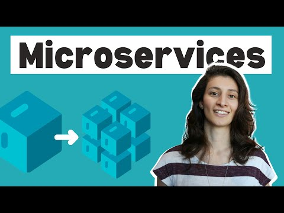

# Microservices explained - the What, Why and How? 

 Microservices explained - the What, Why and How?

Tasks and notes from crash course. Made by TechWorld with Nana

[Source](#)

If the content sparked 🔥 your interest, please consider staring the course and start learning 📖

### Progress/Curriculum 

- [ ] [Section 01](#) - Intro and Overview
- [ ] [Section 02](#) - Monolith & its challenges
- [ ] [Section 03](#) - What are Microservices exactly?
- [ ] [Section 04](#) - How Microservices communicate with each other?
- [ ] [Section 05](#) - Downsides of Microservices
- [ ] [Section 06](#) - CI/CD Pipeline for Microservices
- [ ] [Section 07](#) - Monorepo vs Polyrepo - How to manage the code for microservices aplication?
- [ ] [Section 08](#) - Monorepo explained - Benefits and Disadvantages
- [ ] [Section 09](#) - Polyrepo explained - Benefits and Disadvantages
- [ ] [Section 10](#) - Which one to choose when?
