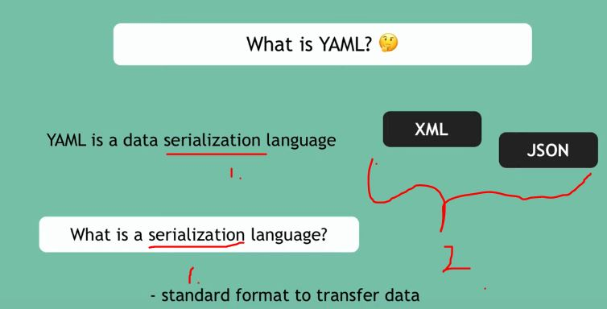
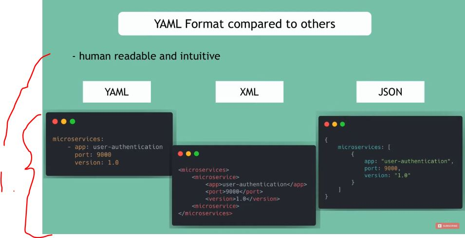
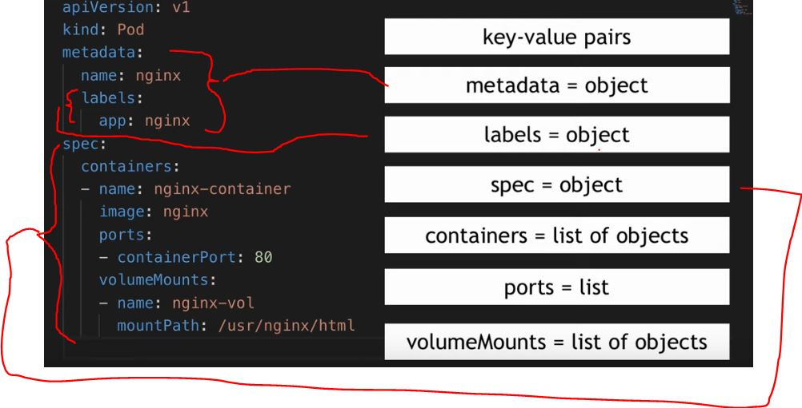
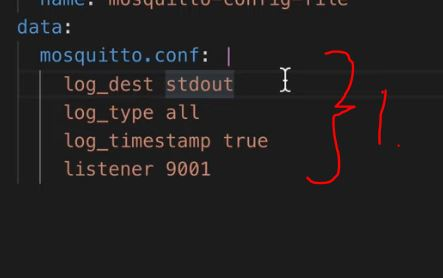
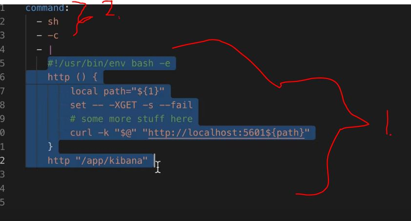
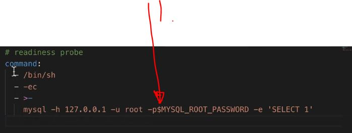
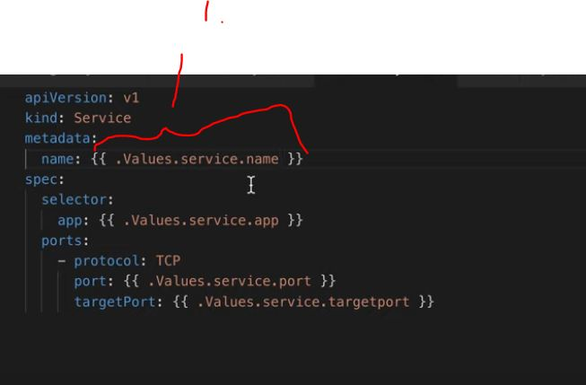
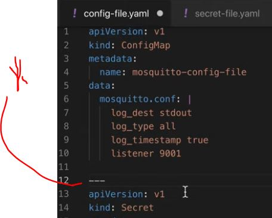
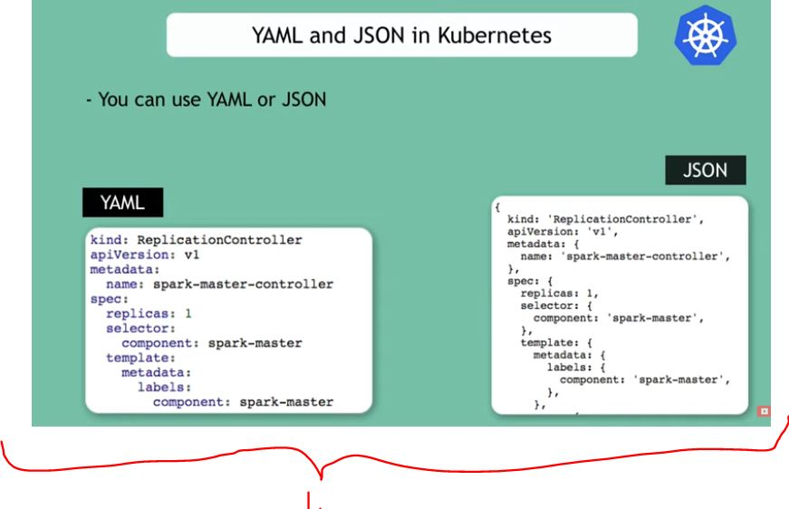

# Yaml Tutorial | Learn YAML in 18 mins 

 Yaml Tutorial | Learn YAML in 18 mins 


Tasks and notes from crash course. Made by TechWorld with Nana

[Source](https://www.youtube.com/watch?v=pg19Z8LL06w)

If the content sparked 🔥 your interest, please consider staring the course and start learning 📖

### Progress/Curriculum 

- [x] [Section 01](#) - Intro
- [x] [Section 02](#) - YAML is popular
- [x] [Section 03](#) - What is YAML?
- [x] [Section 04](#) - Why learn YAML? YAML Format compared to XML and JSON
- [x] [Section 05](#) - YAML Use Cases
- [x] [Section 06](#) - YAML Syntax
- [x] [Section 07](#) - Key-value pairs
- [x] [Section 08](#) - Comments
- [x] [Section 09](#) - Objects
- [x] [Section 10](#) - Lists
- [x] [Section 11](#) - Boolean
- [x] [Section 12](#) - More about lists
- [x] [Section 13](#) - Real Kubernetes YAML Configuration Example
- [x] [Section 14](#) - Multi-line strings
- [x] [Section 15](#) - Environment variables
- [x] [Section 16](#) - Placeholders
- [x] [Section 17](#) - Multiple Yaml documents
- [x] [Section 18](#) - YAML and JSON in Kubernetes

#  YAML is popular

- **YAML** is popular for writing confirmation files
    - Many tools using **YAML**. Docker, Ansible, Kubernetes, Prometheus
- Widely used format

# What is YAML?



1. Applications written in different languages can transfer data with common language with same standardized language
2. Other serialization languages, **popular ones**

- Comes from `YAML  Ain't Markup Language`. These are the same `.yaml` and `.yml` file extensions

# Why learn YAML? YAML Format compared to XML and JSON



1. Clean looking. Works with **line separation** and **indentation annoying, but makes it so clean!

# YAML Use Cases

- Docker compose file, Ansible, Kubernetes and many other tools

# YAML Syntax

- Key value pairs `port: 9000`
- Comment with `#`

```
app: user-authentication
# Comment here
port: 9000
version: 1,7
```
- **Objects** are in is made with indentation. Here is **Object** **microservices**

```
microservices:
  app: user-authentication
  # Comment here
  port: 9000
  version: 1,7
```

- Since **YAML** is indentation sensitive, you should use online **validation tools**

- **lists** in YAML

```
microservices:
  - app: user-authentication
    # Comment here
    port: 9000
    version: 1,7

```
- **boolean** in YAML
    - These all can express **true** or **false**
```
    # Boolean values
    deployed: on
    deployed: off
    deployed: true
    deployed: false
    deployed: yes
    deployed: no
```

# More about lists

- List of objects 

```
microservices:
  - app: user-authentication
    # Comment here
    port: 9000
    version: 1,7
    # Boolean values
    deployed: on
    deployed: off
    deployed: true
    deployed: false
    deployed: yes
    deployed: no
  - app : shopping-cart
    port: 9002
    version: 1.9

```

- List of microservice names

```
microservices:
  - user-authentication
  - shopping-cart
```

- List inside of list item

```
    version: # List inside list item, with primitive items
    - 1.9 
    - 2.0 
    - 2.1 
```

- Other way to declare list `version: [1.9, 2.0, 2.1]`



# Multi-line strings

- Multiline String is made with **|**

```
multilineString: |
  this is a multipline string
  and tihis is the next line
  next line 
```

```

multilineString: >
  this is a multipline string
  and tihis is the next line
  next line 

```

- This will be interpreted ended as **single line** with character **>**

<hr>

- Multiline String is made with **|**



1. This is style of configuration. Often used for **configuration files**. Content of file



1. **Shell Script** inside **Multiline String** 
2. Commands to start inside Kubernetes

# Environment variables

- Example **POD** who has env variable inside we can access it using `$`




# Placeholders



1. **Placeholder** This will be replaced with value

# Multiple Yaml documents



1. **Separating component** in YAML. Using `---`. These will be interpreted ended as separate 

# YAML and JSON in Kubernetes



1. You can also write Configuration in **JSON** or **YAML**