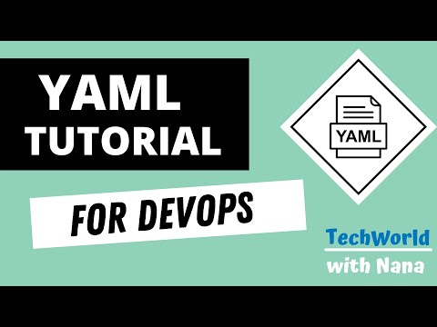

# Yaml Tutorial | Learn YAML in 18 mins 

 Yaml Tutorial | Learn YAML in 18 mins 

Tasks and notes from crash course. Made by TechWorld with Nana

[Source](https://www.youtube.com/watch?v=pg19Z8LL06w)

If the content sparked 🔥 your interest, please consider staring the course and start learning 📖

<!--  -->

### Progress/Curriculum 

- [ ] [Section 01](#) - Intro
- [ ] [Section 02](#) - YAML is popular
- [ ] [Section 03](#) - What is YAML?
- [ ] [Section 04](#) - Why learn YAML? YAML Format compared to XML and JSON
- [ ] [Section 05](#) - YAML Use Cases
- [ ] [Section 06](#) - YAML Syntax
- [ ] [Section 07](#) - Key-value pairs
- [ ] [Section 08](#) - Comments
- [ ] [Section 09](#) - Objects
- [ ] [Section 10](#) - Lists
- [ ] [Section 11](#) - Boolean
- [ ] [Section 12](#) - More about lists
- [ ] [Section 13](#) - Real Kubernetes YAML Configuration Example
- [ ] [Section 14](#) - Multi-line strings
- [ ] [Section 15](#) - Environment variables
- [ ] [Section 16](#) - Placeholders
- [ ] [Section 17](#) - Multiple Yaml documents
- [ ] [Section 18](#) - YAML and JSON in Kubernetes

